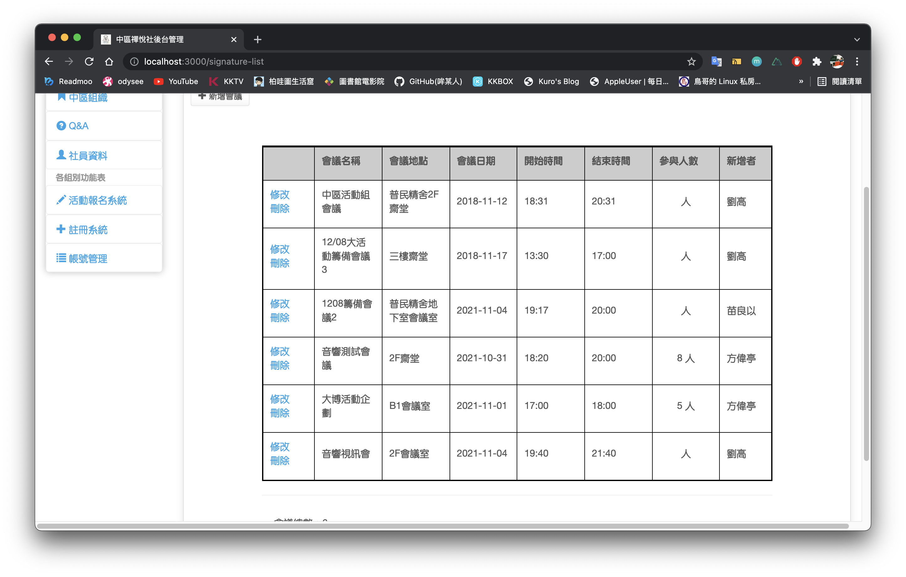
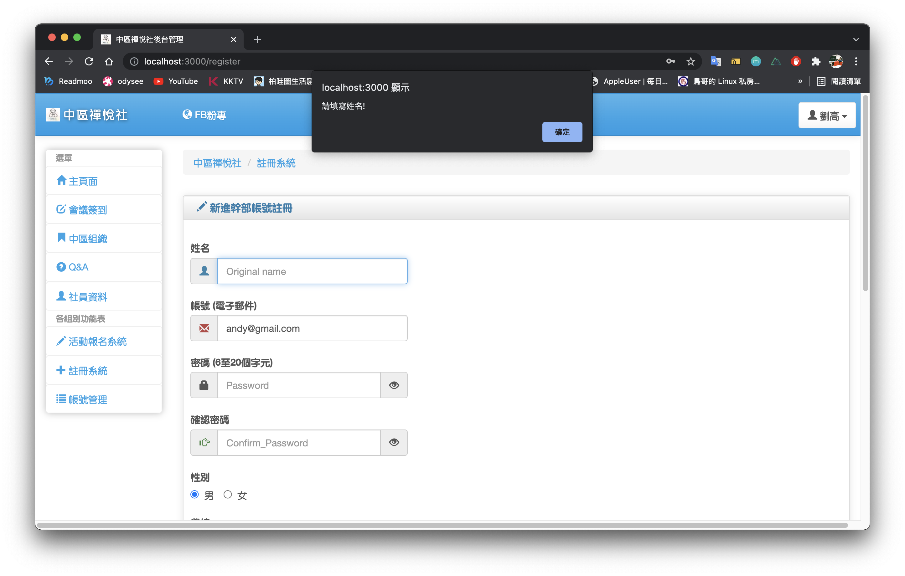

# zen-nuxt
中區禪悅社幹部系統

## Demo
- 建議使用Chrome開啟
- [Click me](http://hsuhome.myds.me/ZenJoy)
- Demo username & password
  - username: cc779@gmail.com
  - password: c1c1zzi

## Development

``` bash
# install dependencies
$ npm install

# serve with hot reload at localhost:3000
$ npm run dev

# build for production and launch server
$ npm run build
$ npm start

# generate static project
$ npm run generate
```

## Screenshot
- Pages<br>
<br>
<br>
<br>
<br>
<br>
<br>
<br>
<br>
<br>

- Sign alert<br>
<br>
<br>

- Add meeting alert<br>
<br>
<br>
<br>
<br>
<br>
<br>
<br>

- Add member alert<br>
<br>
<br>
<br>
<br>
<br>

For detailed explanation on how things work, checkout [Nuxt.js docs](https://nuxtjs.org).
